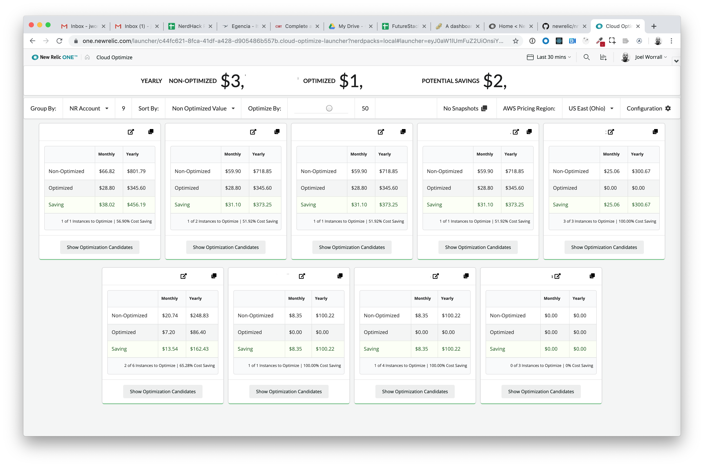
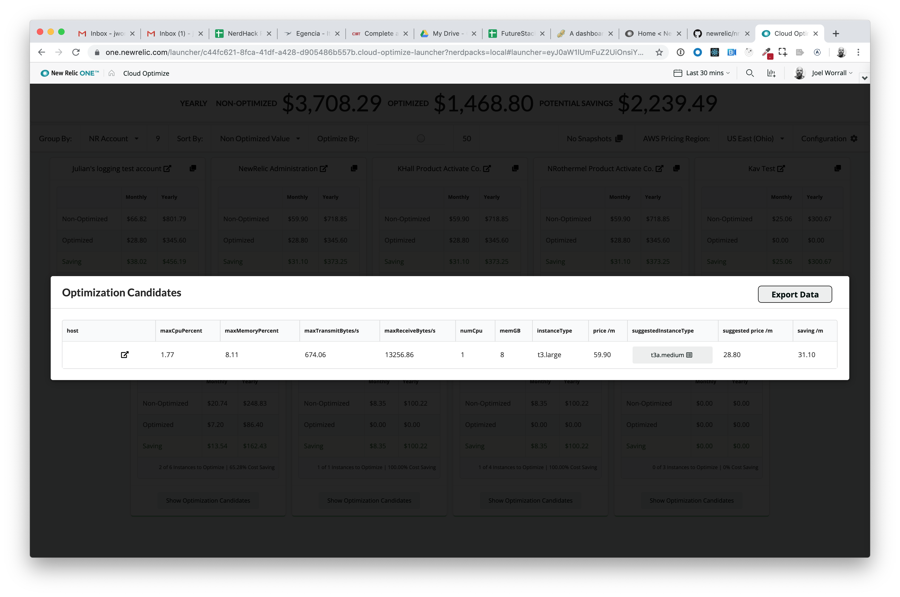
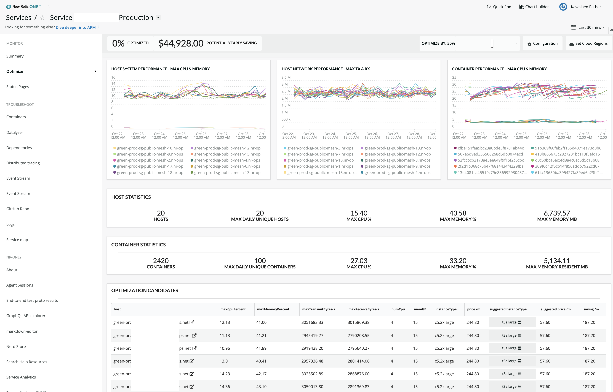

# Cloud Optimize (nr1-cloud-optimize)

 [](https://snyk.io/test/github/newrelic/nr1-cloud-optimize)

## Usage

This application analyzes your cloud environment, and figures out where you're wasting money on excess cloud capacity. The application compares the size of your instances to their utilization, and estimates how much you could save by optimizing the size.

### Support
- AWS
- Azure
- GCP
<br><br>
Note:
When the `instanceType` attribute is available on the `SystemSample` event, the appropriate `instanceType` will be detected against the relevant cloud provider, if this attribute returns `unknown` or is not available the automatic `instanceType` detection will not work. To ensure the best level of support it is recommended to configure the appropriate Infrastructure Cloud Integrations to have the additional metadata decorated and available eg. [EC2 Integration](https://docs.newrelic.com/docs/integrations/amazon-integrations/aws-integrations-list/aws-ec2-monitoring-integration), [Azure VMs](https://docs.newrelic.com/docs/integrations/microsoft-azure-integrations/azure-integrations-list/azure-vms-monitoring-integration), [Google Compute Engine](https://docs.newrelic.com/docs/integrations/google-cloud-platform-integrations/gcp-integrations-list/google-compute-engine-monitoring-integration).<br>
To confirm you can use the following query for eg. `SELECT * FROM SystemSample WHERE hostname = 'my-host'` and confirm the `instanceType` attribute.





In-Context Application Optimization requires APM

## Open Source License

This project is distributed under the [Apache 2 license](blob/master/LICENSE).

## What do you need to make this work?

Required:

- [New Relic Infrastructure agent(s) installed](https://docs.newrelic.com/docs/agents/manage-apm-agents/installation/install-agent#infra-install) on your cloud computing devices and the related access to [New Relic One](https://newrelic.com/platform).

You'll get the best possible data out of this application if you also:

- [Activate the EC2 integration](https://docs.newrelic.com/docs/integrations/amazon-integrations/get-started/connect-aws-infrastructure) to group by your AWS cloud provider account.
- [Activate the Azure VMs integration](https://docs.newrelic.com/docs/integrations/microsoft-azure-integrations/azure-integrations-list/azure-vms-monitoring-integration) to group by your Azure cloud provider account.
- [Activate the Google Compute integration](https://docs.newrelic.com/docs/integrations/google-cloud-platform-integrations/gcp-integrations-list/google-compute-engine-monitoring-integration) to group by your GCP cloud provider account.
- [Install APM on your applications](https://docs.newrelic.com/docs/agents/manage-apm-agents/installation/install-agent#apm-install) to group by application.

## Getting started

First, ensure that you have [Git](https://git-scm.com/book/en/v2/Getting-Started-Installing-Git) and [NPM](https://www.npmjs.com/get-npm) installed. If you're unsure whether you have one or both of them installed, run the following command(s) (If you have them installed these commands will return a version number, if not, the commands won't be recognized):

```bash
git --version
npm -v
```

Next, install the [NR1 CLI](https://one.newrelic.com/launcher/developer-center.launcher) by going to [this link](https://one.newrelic.com/launcher/developer-center.launcher) and following the instructions (5 minutes or less) to install and setup your New Relic development environment.

Next, to clone this repository and run the code locally against your New Relic data, execute the following commands:

```bash
nr1 nerdpack:clone -r https://github.com/newrelic/nr1-cloud-optimize.git
cd nr1-cloud-optimize
nr1 nerdpack:serve
```

Visit [https://one.newrelic.com/?nerdpacks=local](https://one.newrelic.com/?nerdpacks=local), navigate to the Nerdpack, and :sparkles:

## Deploying this Nerdpack

Open a command prompt in the nerdpack's directory and run the following commands.

```bash
# If you need to create a new uuid for the account to which you're deploying this Nerdpack, use the following
# nr1 nerdpack:uuid -g [--profile=your_profile_name]
# to see a list of APIkeys / profiles available in your development environment, run nr1 credentials:list
nr1 nerdpack:publish [--profile=your_profile_name]
nr1 nerdpack:deploy [-c [DEV|BETA|STABLE]] [--profile=your_profile_name]
nr1 nerdpack:subscribe [-c [DEV|BETA|STABLE]] [--profile=your_profile_name]
```

Visit [https://one.newrelic.com](https://one.newrelic.com), navigate to the Nerdpack, and :sparkles:

## Support

New Relic has open-sourced this project. This project is provided AS-IS WITHOUT WARRANTY OR SUPPORT, although you can report issues and contribute to the project here on GitHub.

_Please do not report issues with this software to New Relic Global Technical Support._

### Community

New Relic hosts and moderates an online forum where customers can interact with New Relic employees as well as other customers to get help and share best practices. Like all official New Relic open source projects, there's a related Community topic in the New Relic Explorers Hub. You can find this project's topic/threads here:

https://discuss.newrelic.com/t/cloud-optimizer-nerdpack/82936
*(Note: URL subject to change before GA)*

### Issues / Enhancement Requests

Issues and enhancement requests can be submitted in the [Issues tab of this repository](https://github.com/newrelic/nr1-cloud-optimize/issues). Please search for and review the existing open issues before submitting a new issue.

## Contributing

Contributions are welcome (and if you submit a Enhancement Request, expect to be invited to contribute it yourself :grin:). Please review our [Contributors Guide](blob/master/CONTRIBUTING.md).

Keep in mind that when you submit your pull request, you'll need to sign the CLA via the click-through using CLA-Assistant. If you'd like to execute our corporate CLA, or if you have any questions, please drop us an email at opensource@newrelic.com.
